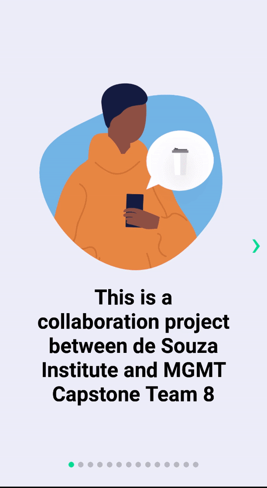
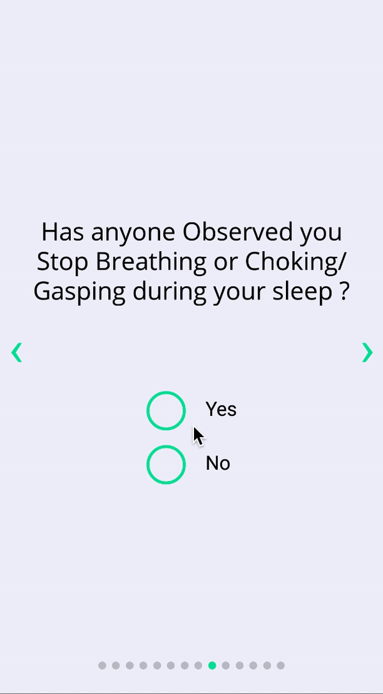
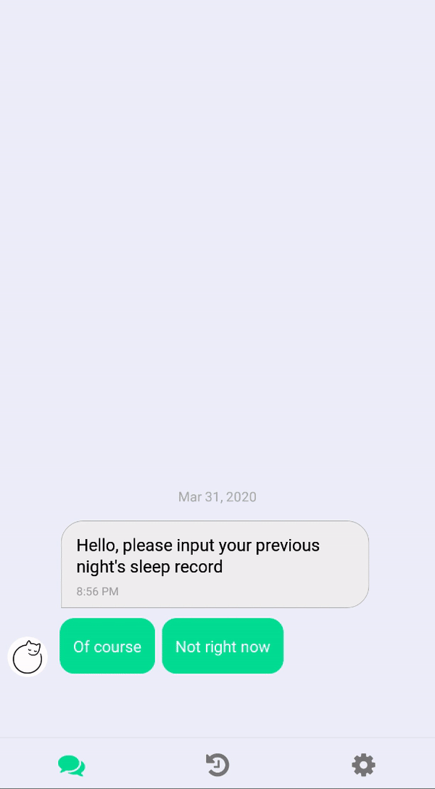

# SleepWell
An insomnia CBTi Chatbot by **de Souza Institude** and **UW Management Engineering Capstone 2020**

See under /src for code breakdown

The SleepWell chatbot is based off [Dr. Sheila Garland's Sleeping Well Manual](https://support.desouzainstitute.com/kb/article/55-sleeping-well-manual?fbclid=IwAR0WDvWJEzrMrapEE-3JiRzE7L4jj9v69SBX37VEDOm9YcBraqlNe0w39tA)

## Technologies
Project is created with:
- React Native
- Android Studios
- XCode

## Show case







## Getting Started 
These instructions will get you a copy of the project up and running on your local machine for development and testing purposes.

### Prerequisites

- [React Native](https://reactnative.dev/docs/environment-setup)
    - Please read above documentation carefully, it is a complete guide for all platforms (Mac, Windows, iOS and Android)
    - From personal experience, running on Android emulator is easiest to set up (Pixel 3 API 27, Android 8.1 Oreo)


## Set up
**always 
```npm install``` 
first**

run on android:
`$react-native run-android`

run on ios:
`$react-native run-ios`


## FAQ

#### Q: I'm seeing [insert error screen]

#### A: Always try:

```npm install``` 

run this beforehand if that doesn't help:
`$react-native run`

#### Q: I'm seeing a "failed to load....." error

#### A: Try restarting metro bundler

#### Q: React Native is stuck after `$react-native run-android`

#### A: If metro bundler is running, try waiting 5-15 minutes for the application to load, RN is often slow for the initial load

#### Q: font is giving me issues on iOS

#### A: Follow this [guide](https://medium.com/@mehran.khan/ultimate-guide-to-use-custom-fonts-in-react-native-77fcdf859cf4) for setting up iOS fonts